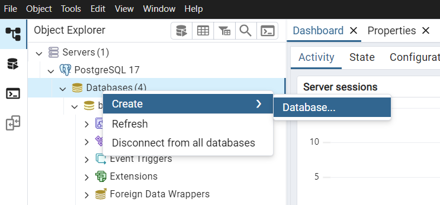
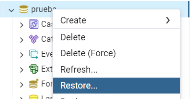
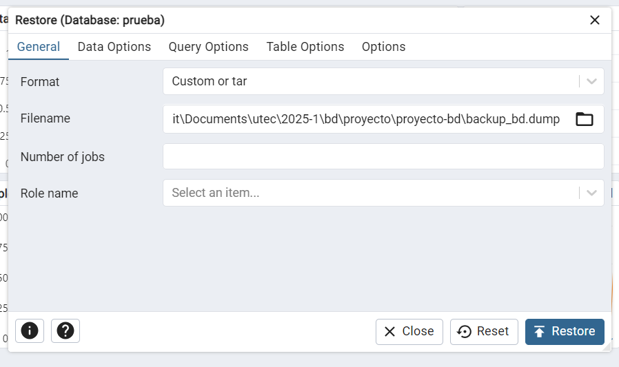
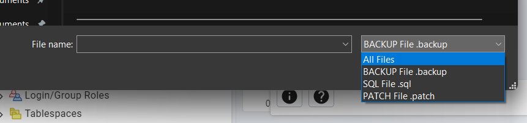

# PROYECTO BASE DE DATOS 💯

## Cargar base de datos

Holi, grupo, en el repo encontrarán el archivo `backup_bd.dump`, para cargar la base de datos hay dos opciones, desde terminal o usando pgAdmin, en esta sección solo mostraré como se hace desde pgAdmin porque ya tengo sueño 😢.

### Usando pgAdmin 

1. Hagan click derecho sobre `Databases`, luego a `Create` y, finalmente, en `Database` le ponen un nombre, en mi caso será **prueba**




2.  Ahora le dan click derecho a la nueva db y luego a `Restore`



3. El formato dejenlo en custom y en `filename` busquen el archivo en la carpeta del repo.



En caso no les aparezca, cambien esa cosita a `All files`


¡Eso es todo! 🔥

## Crear base de datos

En caso quieran poblar la base de datos por su cuenta, en el archivo `crear_tablas.sql` encontrarán el script para crear las tablas de la db. Si usan Visual Studio Code pueden instalar la extensión de `SQLTools`, `SQLTools PostgreSQL/otras-cosas` y ejecutar el script directamente desde ahí. En caso de que no tengan la extensión, pueden copiar el script y pegarlo en el editor de consultas de pgAdmin.

## Generar e insertar datos

Para generar datos de prueba, usaremos la librería `Faker` y `psycopg2` para conectarnos a la base de datos PostgreSQL. Asegúrense de tener instalado el paquete `Faker` y `psycopg2-binary`. Pueden instalarlo ejecutando el siguiente comando en su terminal:

```
pip install faker psycopg2-binary
```

Luego en el archivo de python, asegúrense de establecer la conexión a la base de datos. Aquí les dejo un ejemplo de cómo hacerlo (de todas formas en todos los archivos se encuentra esta cabecera, aun así, revisen el puerto):

```python
conn = psycopg2.connect(
    dbname="proyecto", # Nombre de la base de datos
    user="postgres", # Usuario de la base de datos
    password="postgres", # Contraseña del usuario
    host="localhost", 
    port="5433" # Puerto de la base de datos, lo configuraron en el pgAdmin
)
```

Una vez establecida la conexión, pueden ejecutar el script `cargar_nDatos.py` para generar e insertar datos en las tablas. Este script generará datos de prueba para las tablas que utilizaremos en las consultas.

Pueden correr los scripts como mejor se les acomode.

## Eliminar datos
Si necesitan eliminar los datos de las tablas, pueden usar el script `eliminar_datos.sql` que se encuentra en el repositorio. Este script eliminará todos los datos de las tablas sin eliminar las tablas mismas.

# Acerca del enunciado

## Consideraciones

Se nos dice que debemos considerar que la **“experimentacion**" y "**optimizacion**” debe realizarse mediante 2 o 3 consultas
“**genericas**” con un **nivel aceptable de complejidad en las consultas propuestas**. 

Dichas consultas se deben realizar en cuatro contextos de 1000 (mil) datos, 10000 (diez mil) datos, 100000 (cien mil) datos y 1 000 000 (un millon) de datos almacenados en la base de datos (deberıan tener 4 dumps de su proyecto).

---

Usaremos estas tres consultas como base para la comparación:
1. ¿Qué veterinarios han atendido la mayor cantidad de mascotas en el último mes?
2. ¿Cuál es el tipo de tratamiento más común a perros en los últimos seis meses?
3. ¿Qué día de la semana concentra el mayor número de citas médicas?


(Extra) ¿Cual serıa la complejidad operacional si escalamos los datos por encima del millon?,
realice una comparativa respecto a la cantidad de datos del p ́arrafo anterior. ¿Es suficiente la arquitectura Cliente-Servidor para procesar millones de datos?

